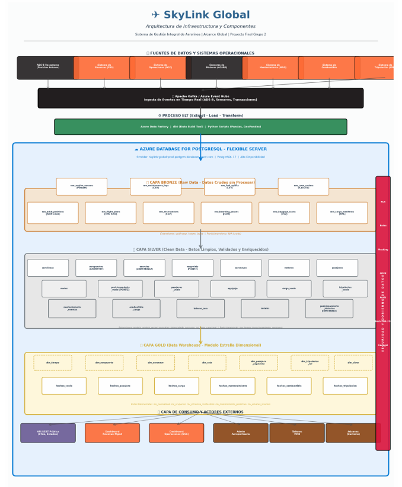
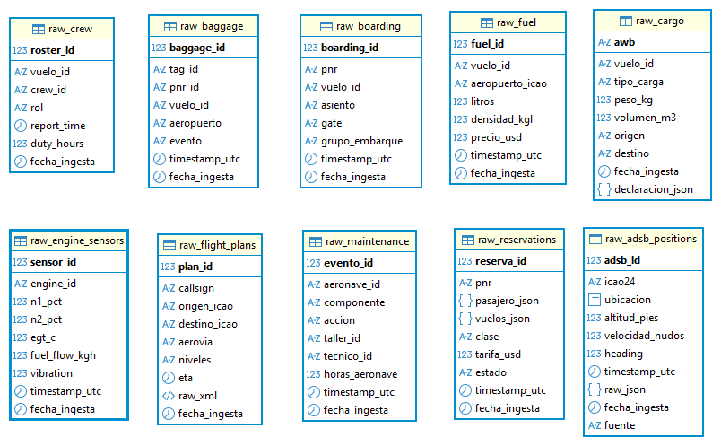
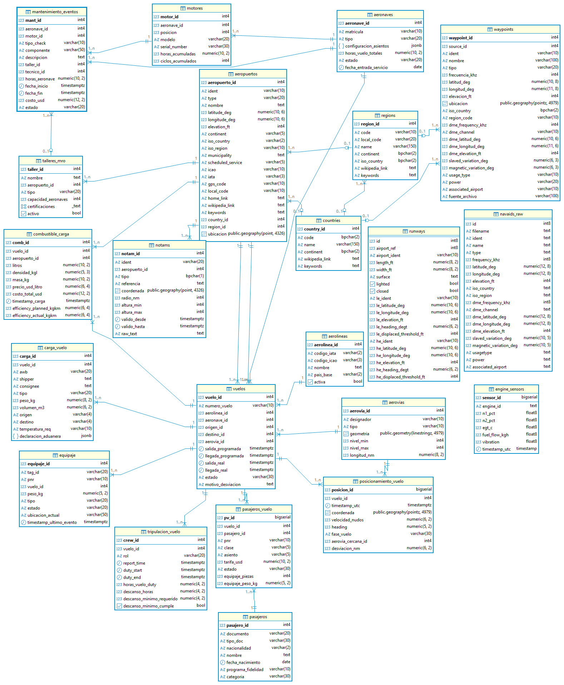
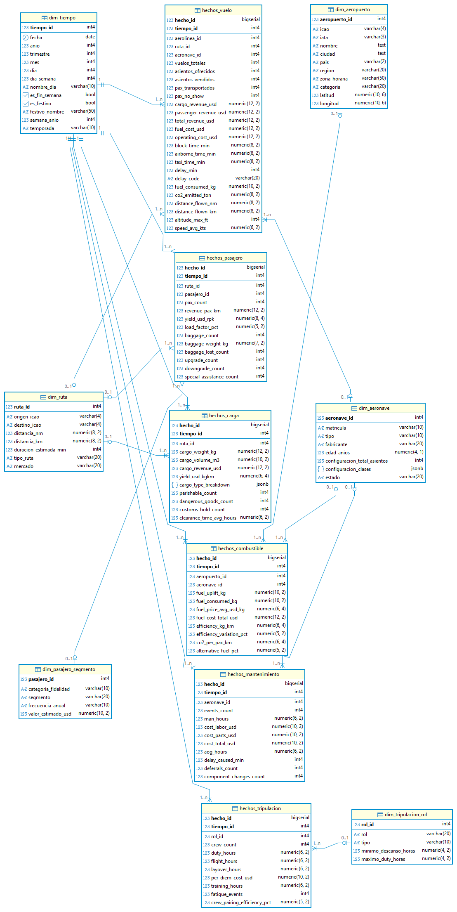
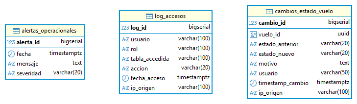
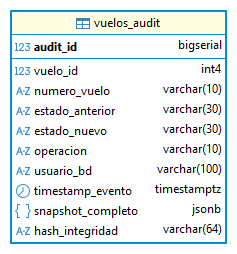

# ✈️ SkyLink Global Airline Data Warehouse


## 📑 Table of Contents

- Project Overview
- Objectives
- Technology Stack
- Solution Architecture
- Data Sources
- Bronze Layer
- Silver Layer
- Gold Layer
- ETL Pipeline
- Project Highlights
- Database Features
- Audit & Data History
- Repository Structure
- Getting Started
- Future Improvements
- Authors
- License


> **End-to-end Data Warehouse solution for airline operations built with Azure and PostgreSQL, implementing ETL pipelines and a Medallion Architecture (Bronze, Silver, Gold) to support scalable data integration and business analytics.**

---

##  Project Overview

Modern airline operations generate large volumes of operational data from multiple sources, including flight plans, passenger reservations, baggage handling, cargo operations, maintenance records, aircraft positioning, fuel consumption, and engine sensor data. Managing this information efficiently requires a scalable architecture capable of integrating, transforming, and organizing data for analytical purposes.

This project presents the design and implementation of an end-to-end Data Warehouse for an airline environment. The solution follows the **Medallion Architecture**, organizing data into **Bronze**, **Silver**, and **Gold** layers to progressively improve data quality and prepare information for business analytics.

The project integrates multiple CSV datasets, catalog tables, and synthetic data generated to simulate real-world airline operations. Through ETL processes, raw data is validated, cleaned, standardized, enriched, and transformed into a dimensional model optimized for reporting and decision-making.

The final solution demonstrates the complete lifecycle of a modern data engineering project, from data ingestion and storage to transformation, integration, and analytical modeling.

---

##  Objectives

- Design and implement an end-to-end Data Warehouse for an airline environment.
- Apply the Medallion Architecture (Bronze, Silver, Gold) to organize the data lifecycle.
- Develop ETL pipelines to ingest, clean, transform, and integrate operational data.
- Import and standardize information from multiple CSV files and catalog tables.
- Generate synthetic datasets to simulate operational scenarios and complement missing information.
- Apply data enrichment techniques to improve data quality and analytical value.
- Build a dimensional model that supports business intelligence and reporting.

---

##  Technology Stack

| Category | Technologies |
|----------|--------------|
| Cloud | Azure |
| Database | PostgreSQL |
| Language | SQL |
| Architecture | Medallion Architecture |
| Data Processing | ETL |
| Data Sources | CSV Files, Catalog Tables, Synthetic Data |
| Version Control | Git & GitHub |

---

# 🏗️ Solution Architecture

The solution was designed following the **Medallion Architecture**, a layered data engineering approach that progressively improves data quality throughout the data lifecycle.

The architecture is divided into three logical layers:

- **🥉 Bronze Layer:** Stores raw operational data collected from multiple sources without significant transformations.
- **🥈 Silver Layer:** Applies ETL processes to clean, validate, standardize, and enrich the information while integrating catalog tables and business rules.
- **🥇 Gold Layer:** Organizes the processed information into a dimensional model composed of fact and dimension tables optimized for analytics, reporting, and business intelligence.

This architecture provides scalability, data traceability, improved data quality, and a clear separation between raw, refined, and analytical datasets.

<p align="center">
    
</p>

# 📂 Data Sources

The Data Warehouse integrates information from multiple sources to simulate a real-world airline environment. Different datasets were combined to ensure data consistency, completeness, and analytical value throughout the ETL process.

### CSV Files

Operational and reference data were imported from multiple CSV files provided for the project. These datasets served as the primary source for airports, runways, waypoints, navigation aids, countries, regions, and other business entities.

### Catalog Tables

Several catalog tables were created to standardize reference information across the platform. These tables improve data consistency by maintaining validated values that are shared throughout the different layers of the Data Warehouse.

### Synthetic Data

To simulate real airline operations, synthetic datasets were generated for operational tables where real information was unavailable. The generated data follows realistic patterns and supports testing, validation, and analytical scenarios.

### Data Enrichment

Additional transformations were applied during the ETL process to improve data quality by validating records, standardizing formats, eliminating duplicates, and enriching operational information before loading it into the analytical model.

# 🥉 Bronze Layer

The **Bronze Layer** is the foundation of the Medallion Architecture and serves as the repository for raw operational data. Its primary purpose is to preserve the original information with minimal transformations, ensuring traceability and providing a reliable source for downstream processing.

The datasets stored in this layer represent different areas of airline operations and are populated using synthetic data generated to simulate realistic operational scenarios.

### Key Characteristics

- Stores raw operational data.
- Preserves the original structure of each dataset.
- Supports data traceability throughout the ETL process.
- Serves as the input layer for all transformation processes.
- Contains synthetic data that simulates real airline operations.

### Bronze Tables

| Table | Description |
|-------|-------------|
| raw_adsb_positions | Aircraft position tracking information |
| raw_baggage | Baggage handling records |
| raw_boarding | Passenger boarding events |
| raw_cargo | Cargo operations |
| raw_crew | Crew information |
| raw_engine_sensors | Aircraft engine sensor data |
| raw_flight_plans | Flight planning information |
| raw_fuel | Fuel loading and consumption |
| raw_maintenance | Maintenance records |
| raw_reservations | Passenger reservation data |

According to the project implementation, the Bronze layer contains **10 operational tables**, all populated with synthetic data generated to simulate realistic airline activity.

<p align="center">
    
</p>

---

# 🥈 Silver Layer

The **Silver Layer** is responsible for transforming raw operational data into clean, standardized, and business-ready datasets. This layer represents the core of the ETL process, where data quality improvements and business rules are applied before preparing the information for analytical modeling.

Data from the Bronze layer is processed through ETL pipelines that validate records, remove duplicates, standardize formats, integrate catalog information, and enrich operational datasets. These transformations ensure consistency, accuracy, and reliability across the platform.

In addition to the transformed operational data, the Silver layer incorporates catalog tables containing reference information such as airports, countries, regions, runways, waypoints, airlines, and navigation aids. These datasets provide standardized business entities used throughout the Data Warehouse.

### Key Characteristics

- Cleans and validates raw operational data.
- Removes duplicate and inconsistent records.
- Applies business rules during ETL processes.
- Integrates catalog tables with operational datasets.
- Enriches data to improve analytical quality.
- Produces standardized datasets for the Gold layer.

### Silver Tables

| Category | Tables |
|----------|--------|
| Operational Data | aeronaves, vuelos, pasajeros, pasajeros_vuelo, posicionamiento_vuelo, equipaje, carga_vuelo, combustible_carga, mantenimiento_eventos, motores, tripulacion_vuelo, talleres_mro, engine_sensors |
| Reference Data | aerolineas, aeropuertos, aerovias, countries, regions, runways, waypoints, navaids_raw, notams |

The Silver layer contains **22 tables**, combining transformed operational information with standardized reference data to create a trusted data foundation for analytical workloads.

<p align="center">
    
</p>

> 💡 **Why is the Silver Layer important?**
>
> The Silver layer is where raw data becomes trusted data. By applying ETL transformations, validation rules, standardization, and enrichment processes, this layer ensures that downstream analytical models are built on reliable and consistent information.
>
> ---

# 🥇 Gold Layer

The **Gold Layer** represents the final stage of the Medallion Architecture and contains the analytical data model designed to support Business Intelligence, reporting, dashboards, and decision-making.

At this stage, the cleansed and standardized information from the Silver layer is transformed into a dimensional model following the **Star Schema** approach. This model organizes data into **Fact Tables** and **Dimension Tables**, providing optimized query performance and simplifying analytical workloads.

The Gold layer serves as the trusted source for business analysis by consolidating operational information into meaningful business metrics and relationships.

### Key Characteristics

- Implements a dimensional data model (Star Schema).
- Organizes information into Fact and Dimension tables.
- Optimized for analytical queries and reporting.
- Supports Business Intelligence and decision-making.
- Uses trusted and validated data from the Silver layer.

### Dimension Tables

| Dimension | Purpose |
|-----------|---------|
| dim_aeronave | Aircraft information |
| dim_aeropuerto | Airport information |
| dim_pasajero_segmento | Passenger segmentation |
| dim_ruta | Flight routes |
| dim_tiempo | Time dimension |
| dim_tripulacion_rol | Crew roles |

### Fact Tables

| Fact Table | Business Process |
|------------|------------------|
| hechos_vuelo | Flight operations |
| hechos_pasajero | Passenger analytics |
| hechos_carga | Cargo operations |
| hechos_combustible | Fuel consumption |
| hechos_mantenimiento | Maintenance events |
| hechos_tripulacion | Crew operations |

The Gold layer contains **12 analytical tables**, including **6 Dimension Tables** and **6 Fact Tables**, providing a robust foundation for business intelligence and advanced analytics.

<p align="center">
    
</p>

> 💡 **Why is the Gold Layer important?**
>
> The Gold layer transforms trusted operational data into business-ready information. By organizing data into fact and dimension tables, it enables efficient reporting, KPI analysis, dashboards, and decision-making while reducing query complexity for analytical workloads.
>
> ---

# 🔄 ETL Pipeline

The ETL (Extract, Transform, Load) pipeline is the core process that moves data through the Medallion Architecture. It enables the integration of multiple data sources while ensuring data quality, consistency, and analytical readiness.

### Extract

Data is collected from multiple CSV files and synthetic datasets representing different airline operations. These datasets are ingested into the Bronze layer while preserving their original structure.

### Transform

Data is processed through ETL workflows that validate records, standardize formats, integrate catalog tables, apply business rules, and enrich operational information before loading it into the next layer.

### Load

The transformed datasets are stored in the Silver layer and later organized into a dimensional model in the Gold layer, making the information ready for reporting, analytics, and business intelligence.

## ETL Workflow

```text
CSV Files
Synthetic Data
Catalog Tables
        │
        ▼
Bronze Layer
(Raw Data Storage)
        │
        ▼
ETL Processes
• Validation
• Cleaning
• Standardization
• Enrichment
        │
        ▼
Silver Layer
(Business-ready Data)
        │
        ▼
Dimensional Modeling
        │
        ▼
Gold Layer
(Analytics & BI)
```

# 🌟 Project Highlights

This project was designed as a complete Data Engineering solution for an airline environment, covering the full data lifecycle from ingestion to business analytics.

### Key Features

-  End-to-End Data Warehouse implementation.
-  Medallion Architecture (Bronze, Silver, Gold).
-  Azure cloud integration.
-  PostgreSQL relational database.
-  ETL pipelines for data ingestion and transformation.
-  Integration of multiple CSV datasets.
-  Synthetic data generation for realistic operational scenarios.
-  Data enrichment and standardization.
-  Catalog tables for reference data management.
-  Dimensional modeling using a Star Schema.
-  Fact and Dimension tables for Business Intelligence.
-  SQL Views for simplified analytical queries.
-  Stored Functions to automate business logic.
-  Database Triggers for process automation.
-  Security Roles for database access control.
-  Geospatial functions for location-based data.
-  Audit mechanisms for data traceability.

---

# 🔍 Audit & Data History

To improve traceability and data governance, the project includes dedicated database structures for auditing and historical data management. These mechanisms allow tracking of relevant database operations and preserve historical information for analytical and administrative purposes.

### Audit Model

<p align="center">
    
</p>

### History Model

<p align="center">
    
</p>


---

# 📁 Repository Structure

```text
SkyLinkGlobal-DataWarehouse
│
├── docs
│   ├── diagrams
│   │   ├── arquitectura_solucion.png
│   │   ├── erd_bronze.png
│   │   ├── erd_silver.png
│   │   ├── erd_gold.png
│   │   ├── erd_audit.png
│   │   └── erd_history.png
│   │
│   ├── presentation
│   └── justification
│
├── sql
│   ├── bronze
│   ├── silver
│   ├── gold
│   ├── functions
│   ├── triggers
│   ├── views
│   ├── roles
│   └── synthetic_data
│
├── README.md
├── LICENSE
└── .gitignore
```

---

# 🚀 Getting Started

To explore this project locally:

## 1. Clone the repository

```bash
git clone https://github.com/YOUR_USERNAME/SkyLinkGlobal-DataWarehouse.git
```

## 2. Open the project

Use PostgreSQL together with your preferred SQL client (such as pgAdmin, DBeaver, or Azure Data Studio).

## 3. Execute the SQL scripts

Run the scripts following the Medallion Architecture order:

1. Bronze Layer
2. Silver Layer
3. Gold Layer
4. Functions
5. Views
6. Triggers
7. Roles

## 4. Explore the documentation

The repository includes architecture diagrams, ER diagrams, project documentation, and presentation materials to better understand the implemented solution.

---

# 🚀 Future Improvements

Possible future enhancements include:

- Integration with real-time streaming data.
- Power BI dashboards for business visualization.
- Automated ETL orchestration.
- Data quality monitoring.
- Cloud deployment automation.
- Additional analytical KPIs.

- ---

# 👥 Authors

This project was developed as a collaborative academic project as part of the **Data Analysis** program at **Universidad Hispanoamericana**.

**Repository maintained by Sergio Rodrigues as part of his professional portfolio.**

---

# 📄 License

This project is distributed under the MIT License. See the LICENSE file for more information.

---

# 🙏 Acknowledgements

Special thanks to the professors, teammates, and Universidad Hispanoamericana for providing the opportunity to develop this end-to-end Data Warehouse project and apply modern Data Engineering concepts in a real-world academic scenario.
